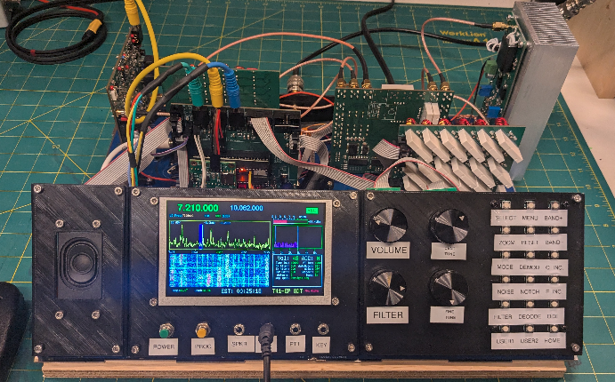
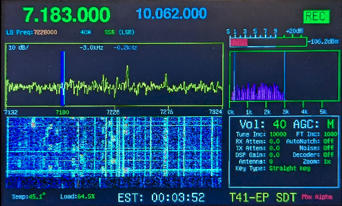
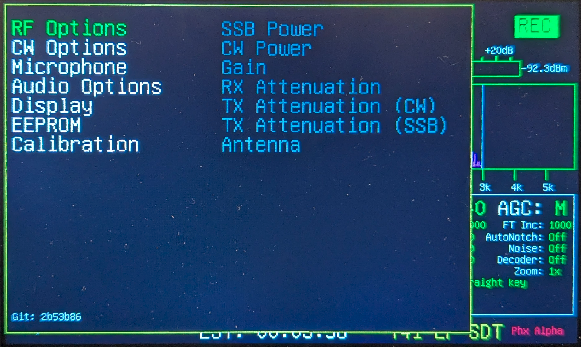
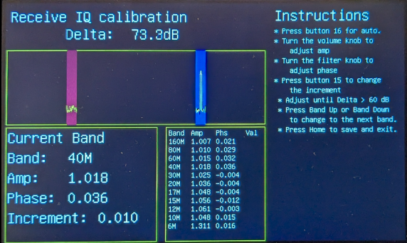
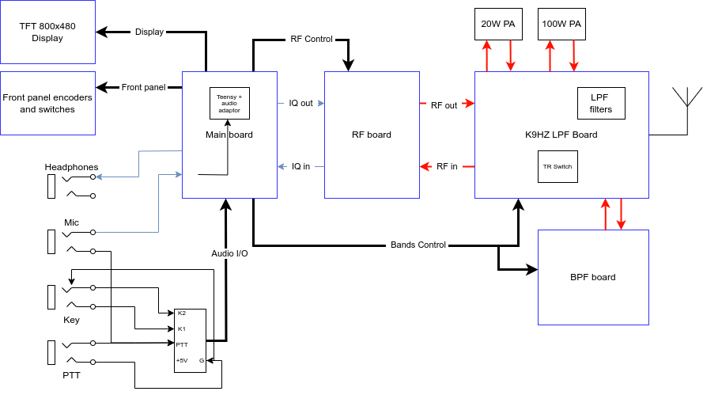
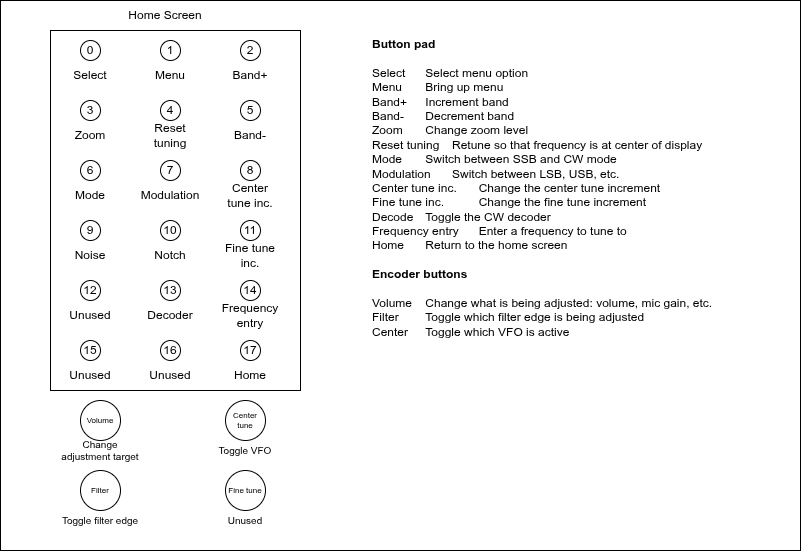
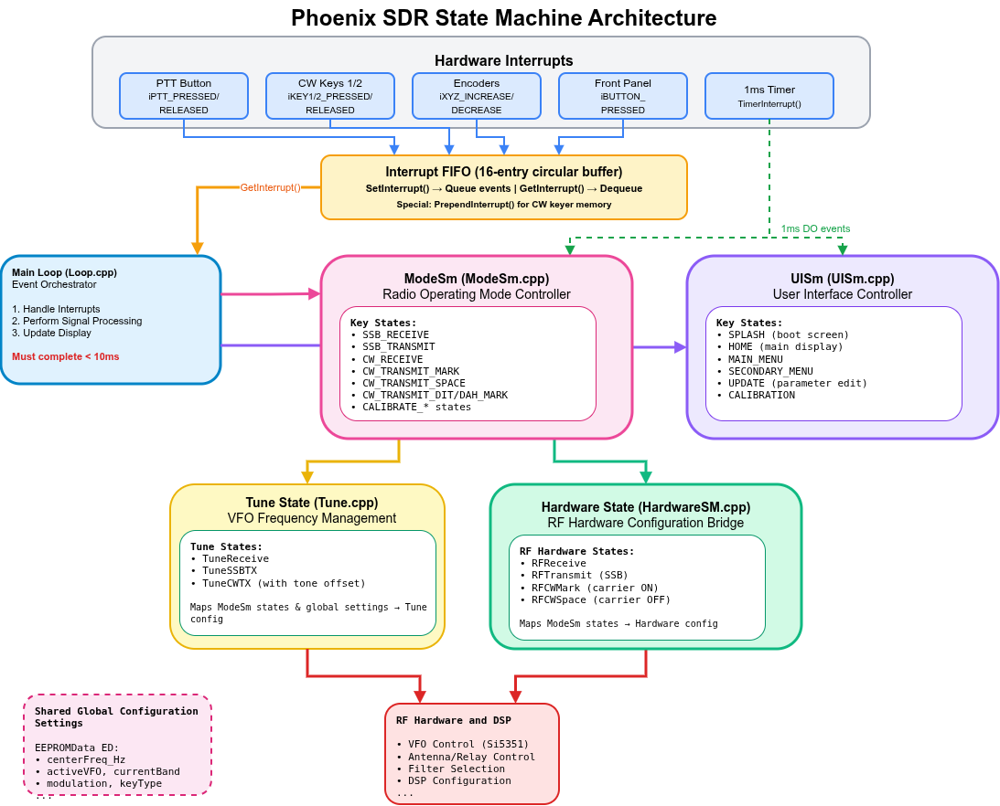
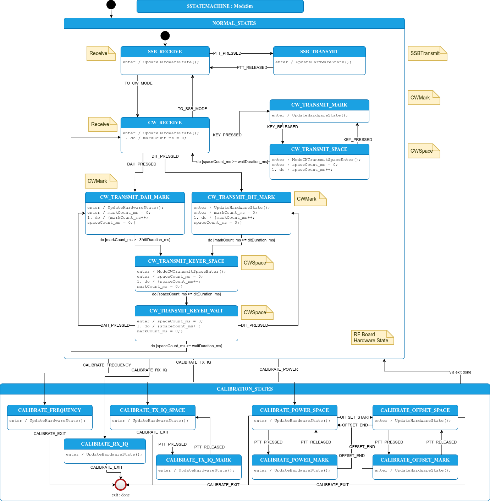
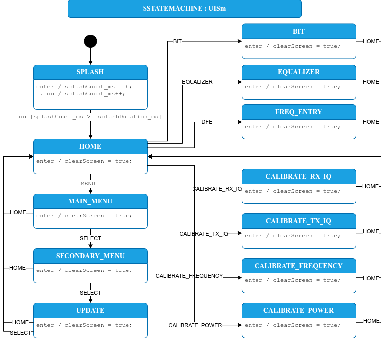
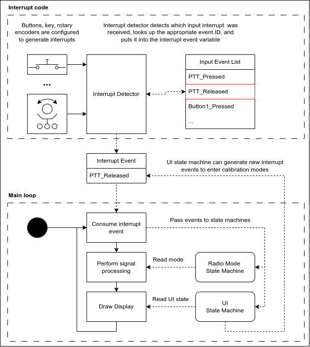

# This repository 

This repository had been updated by KC9KKO and N3DS with code for 		FT8(Internal to the T41), WSJT-X connectivity via USB, 
	a Wireless Keyboard and mouse driver.

FT8( Internal )	based on KN6ZDEÕs experimental implementation.
			in addition screens for FT8 display as added.

WSJT-X USB connection also based on KN6ZDEÕs experimental code.
Updates to PhoenixÕs CAT via USB integrated WSJT-X.


Keyboard and Mouse was updated to allow for wireless connections.
	
This is a new software approach, called Phoenix, for the T41-EP radio running V12 hardware. It is a ground-up rewrite of the T41 software, which had been authored by dozens of people over the years. I have listed the known authors that left their call signs in the code in the file `code/Contributors.txt` -- please let me know if I've missed anyone!



# T41-EP overview

The T41-EP Software Defined Transceiver (SDT), originally designed by Al Peter-AC8GY and Jack Purdum-W8TEE, is a 20W, HF, 7 band, CW/SSB Software Defined Transceiver (SDT) with features like 192kHz spectrum display bandwidth, ALP CW decoder, Bode Plots. The T41-EP is a self-contain SDT that does not require an external PC, laptop, or tablet to use. Al and Jack wrote a book, available on [Amazon](https://www.amazon.com/Digital-Signal-Processing-Software-Defined/dp/B0F5BDQZW3), describing the theory and operation of the T41-EP. The [project's website](https://t41sdrtransceiver.wordpress.com/) gives an overview of the project and its history.

Some of the features of the T41 V12 hardware running the Phoenix firmware:

* Operation across all amateur radio bands from 160m to 6m.
* Controllable receive and transmit power levels in 0.5 dB steps.
* Audio gain control via a variety of algorithms.
* Noise reduction via a variety of algorithms.
* Receive and transmit audio equalizers.
* Automated receive IQ calibration routine.
* CAT control.

The T41-EP is a fully open-source radio. This repository hosts the transceiver software, licensed under GPLV3 (see LICENSE file). The hardware designs are hosted on Bill-K9HZ's [GitHub repository](https://github.com/DRWJSCHMIDT/T41/tree/main/T41_V012_Files). The primary forum for discussions on the T41-EP radio is on [Groups.io](https://groups.io/g/SoftwareControlledHamRadio/topics).

The EP stands for Experimenter's Platform because the T41-EP is designed around 5 small printed circuit boards (100mm x 100mm) that can be easily swapped for boards of your own design. Because the T41-EP project is completely Open Source, you have complete access to the C/C++ source code that controls the T41-EP as well as the KiCad design files, schematics, and Gerber files. 

The hardware design files for the V12 radio modules can be found at the following links:

* [Main board](https://github.com/DRWJSCHMIDT/T41/tree/main/T41_V012_Files/T41_V012_PCBs/T41_V012_PCBs_KiCad/T41-main-board-V012)
* [RF board](https://github.com/DRWJSCHMIDT/T41/tree/main/T41_V012_Files/T41_V012_PCBs/T41_V012_PCBs_KiCad/T41-RF-board-V012)
* [BPF board](https://github.com/DRWJSCHMIDT/T41/tree/main/T41_V012_Files/T41_V012_PCBs/T41_V012_PCBs_KiCad/T41-BPF-filter-board)
* [Front panel switch board](https://github.com/DRWJSCHMIDT/K9HZ/tree/main/K9HZ_Front_Panel_Boards)
* [Front panel encoder boards](https://github.com/DRWJSCHMIDT/K9HZ/tree/main/K9HZ_Encoder_Boards)
* [LPF module](https://github.com/DRWJSCHMIDT/K9HZ/tree/main/K9HZ_LPF_Module)
* [20W amplifier module](https://github.com/DRWJSCHMIDT/K9HZ/tree/main/K9HZ_20W_PA)

The latest version (V12.6) of the bare PCBs are available for less than $5 each on the [discussion forum](https://groups.io/g/SoftwareControlledHamRadio) by contacting Bill K9HZ. If you prefer a partially-assembled kit,  Justin AI6YM sells them on his [website](https://ai6ym.radio/t41-ep-sdt/).


## Screenshots

The home screen should look familiar to users of previous versions of the code, with some change in the layout.



The menu system has been completely rewritten.



As have the calibration routines. The receive IQ calibration can now automatically tune across all the bands with a single button press.



A block diagram of the V12 radio hardware is shown below.



The mapping of the buttons to various functions is defined in `code/src/PhoenixSketch/Config.h`. The default mapping is:



# Version History

## V1.2 Release Notes

### New Features

**Optional Analog SWR Measurement**
A new compile-time option `USE_ANALOG_SWR` enables SWR measurement using Teensy ADC pins 26 (forward) and 27 (reverse) instead of the AD7991 digital ADC. This provides an alternative for builders who prefer analog measurement or don't have the AD7991 chip. Enable this option by uncommenting `#define USE_ANALOG_SWR` in `Config.h`.

**SWR/Power Display Pane**
A new home screen pane displays real-time SWR and forward power during transmit:
- Shows SWR value (1.0-10.0) and forward power in watts
- Updates at 4 Hz during transmit
- Text displays in red during active transmit, white during receive
- Automatically detects transmit activity based on SWR measurement timing

### Under-the-Hood Changes

- Hardware register expanded from 32 to 64 bits to support TXVFOBIT for dual VFO tracking
- Display code optimized to skip spectrum/waterfall updates during SSB transmit mode
- Added `SI5351_DUAL_VFO_ADDR` constant (0x61) for dual VFO hardware configuration
- New `ReadSWRLastUpdateMs()` API function for tracking SWR measurement timing
- Added `DIRECT_COUPLED_TX` compile-time option (disabled by default)
- Added spare button mapping slot in Config.h

## V1.1 Release Notes

### Major New Features

**Dual VFO Architecture**
The radio now supports separate RX and TX VFOs using independent Si5351 clock outputs. This enables monitoring the transmit signal on the receiver during SSB transmission - you can now see your own transmitted spectrum on the display in real-time. The system auto-detects whether dual VFO hardware is present and adjusts operation accordingly.

**Automatic Calibration System**
Three new state machine-driven auto-calibration routines have been added:
- **RX IQ Calibration** - Automatically optimizes receive IQ balance to minimize opposite sideband leakage
- **TX IQ Calibration** - Auto-tunes transmit IQ parameters for optimal sideband suppression
- **TX Carrier Nulling** - Automatically minimizes carrier leakthrough using DC offset correction

All three use a gradient-based optimization algorithm that searches for optimal settings without requiring external test equipment. The calibration values are stored per-band.

**Desktop Radio Simulator**
A new SDL-based simulator (`radio_simulator`) allows testing the complete radio firmware on a desktop PC. Features include:
- Full 800x480 display emulation
- Keyboard mappings for all front panel buttons and encoders
- Selectable audio sources: computer input, two-tone test, single-tone, or RX IQ test signals
- Real-time DSP processing with audio output to computer speakers
- Configuration file read/write to persistent storage

### Under-the-Hood Changes

- Hardware register expanded from 32 to 64 bits to accommodate dual VFO state tracking
- VFO API renamed from `SetSSBVFOFrequency()` to `SetRXVFOFrequency()`/`SetTXVFOFrequency()`
- New hardware states added: `RFCalTransmitIQSingleVFO`, `RFCalTransmitIQDualVFO`, `RFCalTransmitCarrier`
- Improved test infrastructure with expanded mocks for OpenAudio, LittleFS, and ArduinoJson
- Added transmit chain unit tests
- Buffer print diagnostic added for debugging hardware register state

# File Organization

## Source Code Locations

The main Arduino sketch and all accompanying source files are located here:

* **Teensy Source Code**: `code/src/PhoenixSketch/`

The comprehensive unit tests, mocking functions, and their build files are located here:

* **Unit tests**: `code/test`

Useful sketches for testing the boards as you build them are here:

* **Board tests**: `code/src/BoardTest`

The sketch for the ATTiny85 in the main board power control block is here:

* **ATTiny85 power control**: `code/src/ATTiny85_On_Off`

## Useful Diagrams (.drawio files)

These diagrams can be edited with draw.io. Some are used to generate state machine code with StateSmith:

* **code/src/PhoenixSketch/ModeSm.drawio**: StateSmith radio mode state machine - controls transmit/receive states, mode selection (SSB/CW), and hardware transitions
* **code/src/PhoenixSketch/UISm.drawio**: StateSmith user interface state machine - manages display states, menu navigation, and screen layouts
* **images/state_machine_architecture.drawio**: High-level state machine architecture diagram showing how the state machines interact
* **code/docs/window_panes.drawio**: UI window pane layout designs and screen organization, button functions
* **code/docs/HAL_diagrams/T41_V12_board_api.drawio**: Hardware abstraction layer API documentation for the T41 V12 board interfaces

# Architecture overview

Phoenix SDR is built around a state machine-driven architecture that ensures deterministic hardware control. Events like button presses, CAT commands, or encoder turns are placed in an interrupt buffer and handled at a predictable point in the code, preventing state corruption. The code implements hardware abstraction for testability and modularity.

1. **Separation of Concerns**: Hardware control, signal processing, and display are isolated into separate modules with clear interfaces. Hardware interfaces (RFBoard, LPFBoard, BPFBoard) provide clean APIs, allowing mocking for unit tests.
2. **State Machine Control**: All hardware state changes flow through state machines (ModeSm, UISm, TuneSm) ensuring deterministic, predictable behavior.
3. **Separated Display**: Display code is separated from the rest of code and reads the global state but never modifies it. As a demonstration of the display code separation, it can be disabled by commenting out a single line in `loop()` and the radio can operate without the display.
4. **Testing and Debugging**: An extensive set of unit tests ensure that changes to the code don't cause unexpected subtle bugs. The test framework enables you to use software debuggers to exercise the radio code, greatly speeding up the process of finding and fixing most bugs.

## State machines

The behavior of the radio is controlled by a set of state machines. Hardware interrupts, like button presses, are handled by the main loop and used to dispatch events to the Mode and UI state machines, as well as update the shared global configuration settings. The Mode State Machine drives two further state machines: one controls the hardware state, and the other controls the frequencies of the VFOs. The architecture of the state machines is shown in the diagram below.



The state of the radio hardware is controlled by a radio mode state machine. Using a state machine to control the hardware ensures that all hardware is always in a known configuration state. The state machine UML diagram is found in the file `code/src/PhoenixSketch/ModeSm.drawio`, and is shown below.



Similarly, we use a state machine to control the user display. This helps to logically separate the display from the rest of the radio operation, making it more portable and extensible.



State machines can be written entirely in C code, but it's easier to understand how the state machine operates through a drawing. We draw the state machines in a graphical environment and then generate the C code that implements the state machine using [StateSmith](https://github.com/StateSmith/StateSmith). The state machines shown above are examples of this.

## Control flow

The software runs in a loop as shown in the diagram below. It performs three major functions:

1. Handle interrupt events: if an interrupt was registered by, for example, a button being pressed, then pass the appropriate event on to the state machines.
2. Perform the appropriate signal processing, based on the current radio mode.
3. Update the display, based on the current UI state.

Then go back to step 1 and repeat. This loop should take at most 10ms to execute in order to avoid buffer overflows in the audio processing software.



### Handling button presses

We don't want button presses to change the hardware state at random, unspecified times. In order to control the timing of when we respond to button presses, we attach the buttons to interrupts that set an interrupt event register. This register is checked and cleared only once in the main loop. 

## Remote control

The radio will provide two serial interfaces over USB. The first, at a baud rate of 115200, prints debug messages. The second, at a baud rate of 38400, implements CAT control with a partial implementation of the Kenwood TS-480 CAT Interface.


# Build environment

## Arduino

This code has been tested with the Arduino IDE version 2.3.6. Configure your Arduino IDE to use the Teensyduino library following the instructions [here](https://www.pjrc.com/teensy/td_download.html). 

Install the following libraries via the Arduino Library Manager:

* Adafruit MCP23017 Arduino Library, by Adafruit (v2.3.2) (note: install with dependencies)
* ArduinoJson, by Benoit Blanchon (v7.4.3)

Some libraries need to be installed manually. The manual process is:

1. Go to the provided GitHub link for the library and download the library as a zip by clicking Code -> Download ZIP.
2. Import it into the Arduino 2 IDE by clicking Sketch -> Include Library -> Add .ZIP library, and then selecting the file you just downloaded.

The libraries to install using this process are:

* OpenAudio: [https://github.com/chipaudette/OpenAudio_ArduinoLibrary](https://github.com/chipaudette/OpenAudio_ArduinoLibrary)

Configure the Arduino IDE to compile with the following settings:

* Dual Serial
* 600 MHz
* Fast with LTO

You should see the following memory usage when compilation is complete:
```
Memory Usage on Teensy 4.1:
  FLASH: code:287164, data:75372, headers:9172   free for files:7754756
   RAM1: variables:127136, code:283976, padding:10936   free for local variables:102240
   RAM2: variables:300480  free for malloc/new:223808
```

## StateSmith

[StateSmith](https://github.com/StateSmith/StateSmith) is used to generate state machine code from UML diagrams. The diagrams are drawn in draw.io, a graphical diagram editor. draw.io is available in an online version and a desktop version; use the Desktop version which you can download [here](https://www.drawio.com/).

You only need to install the StateSmith binary if you want to update the state machines. The code will compile without StateSmith installed.

Install the StateSmith binary using [these](https://github.com/StateSmith/StateSmith/wiki/CLI:-Download-or-Install) instructions. For simplicity, we recommend using the pre-built binaries rather than building it from source.

## Google Test

The test framework isn't needed to compile and run the code. If you want to modify the code, using the test framework is highly recommended as it will help you discover when your changes break the code.

The Test Driven Development framework we use is [Google Test](https://google.github.io/googletest/). You don't need to install it -- it is downloaded as part of the make process. You need to have [cmake](https://cmake.org/download/) installed. 

The first time you run the unit tests, start in the Phoenix directory and run the following command to create a build directory:

```bash
mkdir code/test/build
```

Then, to build and run the unit tests, do the following:

```bash
cd code/test/build
cmake ../ && make
ctest --output-on-failure
```

This will compile and run the unit test programs. You should see an output that looks something like this:

```bash
...
654/657 Test #654: PowerCalibrationTest.FitPowerCurve_RealWorldData ..............................   Passed    0.00 sec
        Start 655: PowerCalibrationWalkthroughTest.CompleteCalibrationAllBands
655/657 Test #655: PowerCalibrationWalkthroughTest.CompleteCalibrationAllBands ...................   Passed    1.64 sec
        Start 656: PowerCalibrationWalkthroughTest.RemeasuringDataPoints_StateRemainsCorrect
656/657 Test #656: PowerCalibrationWalkthroughTest.RemeasuringDataPoints_StateRemainsCorrect .....   Passed    0.44 sec
        Start 657: PowerCalibrationWalkthroughTest.StateTransitions_ResetBehavior
657/657 Test #657: PowerCalibrationWalkthroughTest.StateTransitions_ResetBehavior ................   Passed    0.49 sec

100% tests passed, 0 tests failed out of 657

Total Test time (real) =  50.16 sec
```


