# Background

Calibrating the power output of the T41 radio happens in two phases. 

1. CW power curve calibration.
2. SSB single-point power calibration.

Each of these phases needs to be performed for the 20W amplifier and the 100W amplifier, if it is installed. Note that as of V1.0 of the Phoenix code, I have not tested the 100W power calibration on real hardware as the 100W amp is not yet ready.

## 1: CW Power Curve

In CW mode, the output power of the radio will vary with the TX attenuation setting according to a curve that looks something like the plot below. Note that the plotted power is RMS power, not PEP. Each band will have its own curve, with variations between the bands being primarily determined by the BPF and LPF passband insertion losses and the PA performance at that frequency.

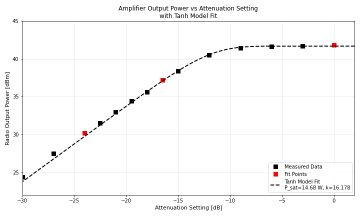

What we see is that the output power varies linearly with attenuation for high attenuation settings: decreasing the attenuation by 3dB increases the power by 3dB. But at some point we start to saturate the power amplifier and the power no longer increases linearly with decreasing attenuation.

The shape of this power vs attenuation curve closely follows a hyperbolic tangent function of this form:

$$
P_{\rm out}[\rm W] ​= P_{\rm sat}[\rm W] \tanh\Big( k 10^{\frac{-A}{10}}​​ \Big)
$$

Here $P_{\rm sat}$ parameterizes the maximum power, i.e., saturation power and $k$ captures the location of the bend in the curve. $A$ is the attenuation setting in dB.

The purpose of power calibration in CW mode is to find the $P_{\rm sat}$ and $k$ parameters that describe the power curve for each band. To do that, we measure the power at three attenuation levels (shown as red squares in the plot) and fit the curve. We could measure the point at more points for an improved fit, but I found that 3 points were enough in my testing.

The calibration process steps through capturing these three points then calculates the best fit and saves the best-fit parameters to storage.

## 2: SSB Calibration

In SSB mode we don't use the TX attenuator to control the power level. Instead, the power level is controlled with a band-dependent DSP gain factor. These parameters are stored in `PowerCal_20W_DSP_Gain_correction_dB` and `PowerCal_100W_DSP_Gain_correction_dB`. The calibration process involves measuring the power at the output of the amplifier while the Phoenix code generates a sine tone. The measured power is used to quantify the overall RF gain of each band and adjust for band-to-band variations. The microphone gain can be adjusted to increase or decrease the power in all bands simultaneously.

# Step-by-step calibration process

The function of each button and encoder on the front panel while we are in power calibration mode is shown in the diagram below.

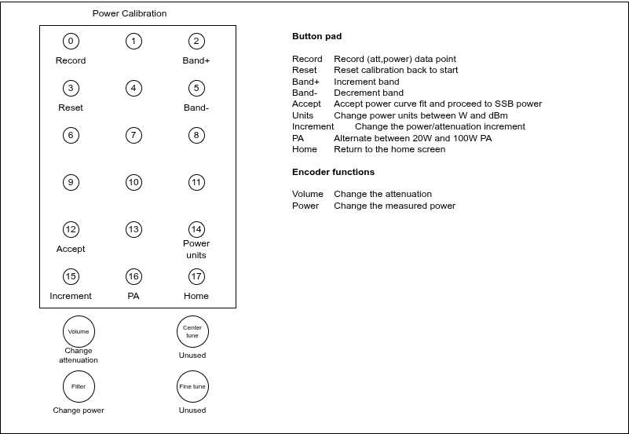

Power calibration is started by selecting "Power" from the "Calibration" menu. The screen will look like the image below.

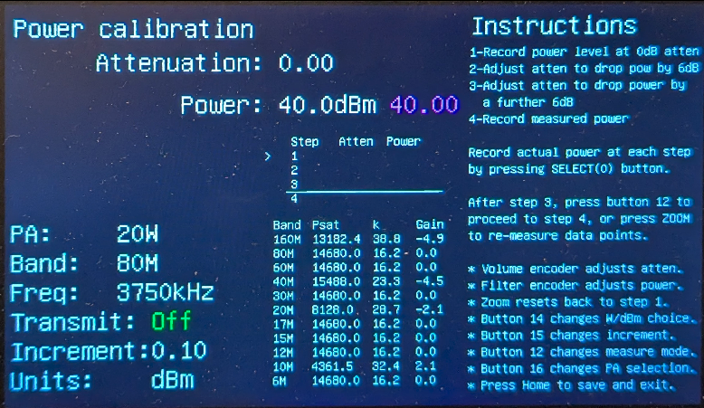

1. Press the PTT button and measure the output power of the radio using an external power meter. Turn the Filter encoder until the power reading displayed on screen matches the output power you just read. If you want to enter the power in units of dBm instead of W, press button 14. In the screen below, I measured a power of 42.2 dBm (16.6W).

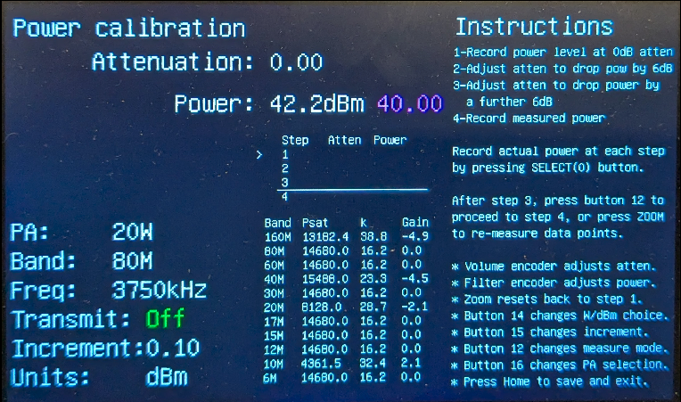

2. Press button 0 to record the power entry. You should see the power you just entered recorded in the table with a green v to represent a check mark that you have completed this step.

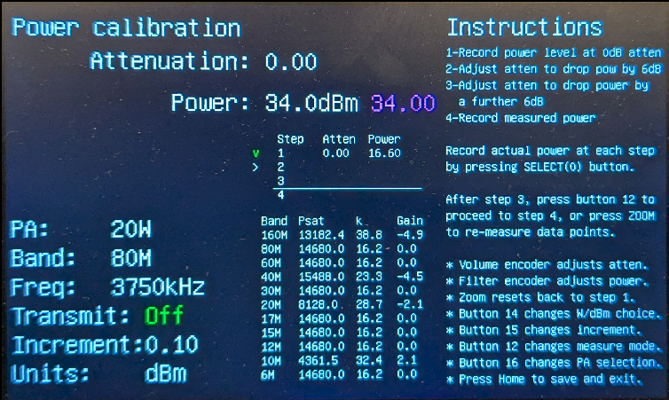

3. Press and hold PTT, then use the volume encoder to increase the attenuation until the measured output power is as close to 2.5W / 34dBm as possible. The magenta text is there to remind you of the target power for this step. You can turn the filter knob to adjust the actual power you measured, since the 0.5dB steps of the attenuator won't necessarily line up with the target power. In the example below, I set the attenuation to 23 dB and set the measured power to 33.9 dBm.

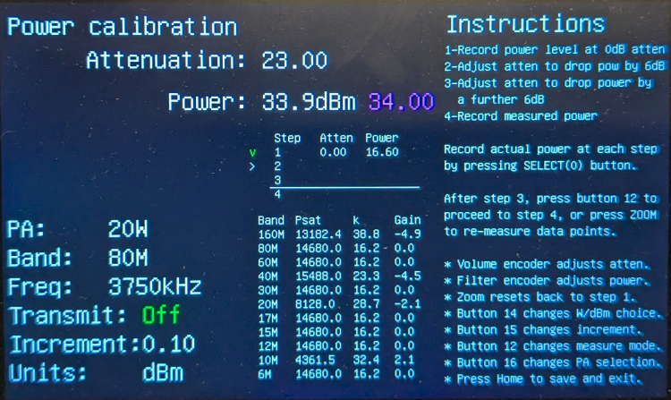

4. Press button 0 to record this entry, which should appear in the table with a green "check mark". The arrow indicating which step you are on should advance to step 3.

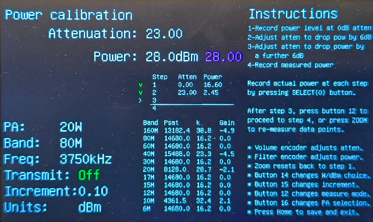

5. Press and hold PTT, then use the volume encoder to increase the attenuation until the measured output power is as close to 0.63W / 28dBm as possible. In the example below, I measured 28dBm exactly with 29.5dB of attenuation.

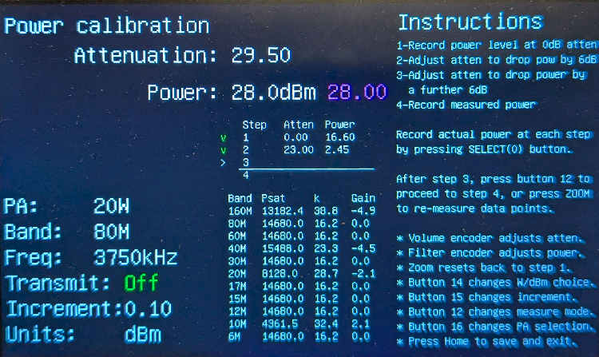

6. Press button 0 to record this entry, which should appear in the table with a green "check mark". At this point, the code will fit a hyperbolic tangent curve to the three data points and display the best-fit parameters in the table. Note in the image below how the `Psat` and `k` values for the 80m band changed from the previous image.

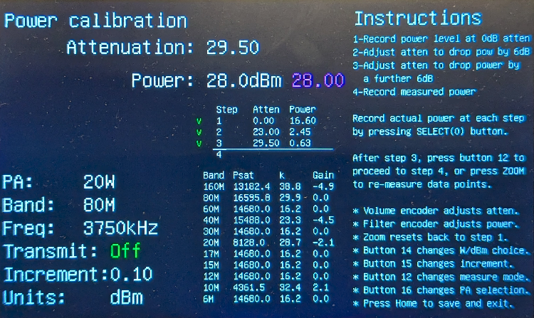

7. If you made a mistake in data entry and want to repeat the above steps, press the Zoom button (button 3) to reset back to the start. You can press the reset button at any time to do this. Otherwise, press button 12 to proceed to the final step, step 4.

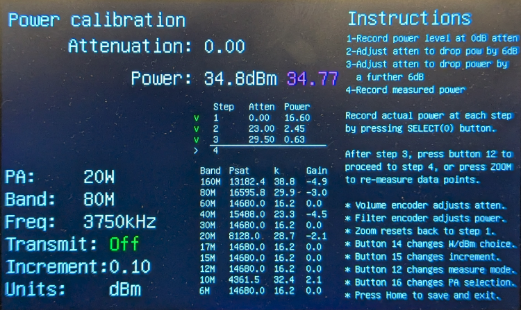

8. Press the PTT button and note the measured power at the output of the radio. The radio is now in SSB mode, not CW mode. Turn the filter encoder until the power reading on screen matches the power you measured.

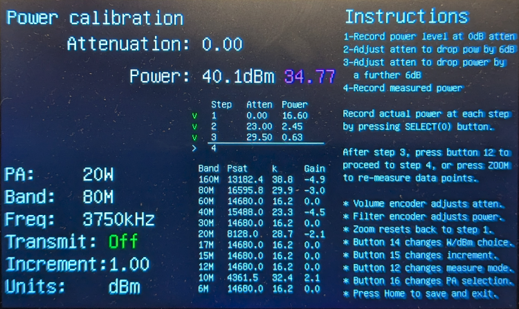

9. Press button 0 to record this data point. The table should now have 4 green check marks and the Gain column should be updated with the computed SSB gain. Congratulations, you have finished power calibration for this band!

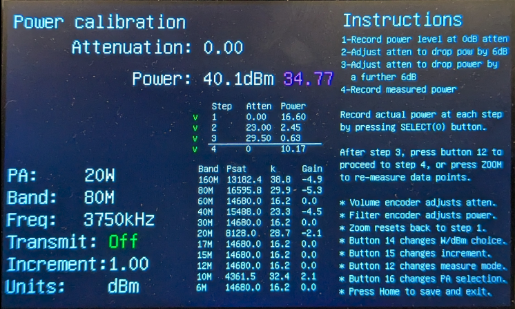

You can now press the band up / band down buttons to perform power calibration in another band. Press the Home button to save the calculated power parameters to storage and return to the home screen.

